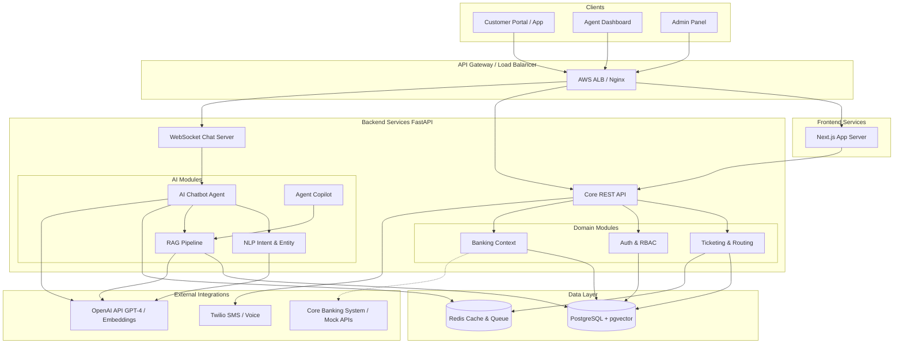

# High-Level Architecture & Code Structure

This document details the system architecture and code structure recommendations for the AI Banking Copilot, emphasizing modularity, security, and AI integration.

## B. High-Level Architecture

The system follows a modern, decoupled microservices-lite architecture.

### Component Diagram (Mermaid)



### Component Interaction Explanations

1.  **Frontend (Next.js):** Hosts the Customer, Agent, and Admin interfaces. It communicates with the backend via REST (for state management, CRUD) and WebSockets (for real-time chat).
2.  **Backend (FastAPI):**
    *   **Core REST API:** Handles standard operations (fetching tickets, user profiles).
    *   **WebSocket Server:** Maintains persistent connections for real-time customer-to-AI or customer-to-Agent chat.
    *   **AI Modules:**
        *   **NLP Service:** Parses incoming messages to classify intent (e.g., "Report Fraud") and extract entities (e.g., "Card ending in 1234").
        *   **RAG Pipeline:** Ingests banking PDFs, chunks them, generates embeddings (via OpenAI), and stores them in PostgreSQL using the `pgvector` extension.
        *   **AI Chatbot Agent:** Orchestrates the LLM. It receives a user message, calls the NLP service for context, queries the RAG pipeline for relevant policy data, and streams the generated response back via WebSocket.
    *   **Domain Modules:**
        *   **Banking Context:** Manages mock representations of Core Banking data (Cards, Transactions, Accounts).
        *   **Ticketing & Routing:** Creates tickets from escalated AI chats, applies SLA rules, and assigns them to the correct agent queue (e.g., Fraud queue).
3.  **Data Layer:**
    *   **PostgreSQL:** The primary relational database. It uses the `pgvector` extension to store vector embeddings for the RAG pipeline alongside traditional relational data (Users, Tickets).
    *   **Redis:** Used for caching frequently accessed data (e.g., user sessions), managing WebSocket pub/sub channels, and as a message broker for background tasks (e.g., SLA timeout alerts).

## D. Code Structure Recommendations

To ensure the backend remains maintainable as complexity grows, we will enforce strict Domain-Driven Design (DDD) principles within the FastAPI application.

### Backend Directory Structure (`ai-copilot/backend/`)

```
backend/
├── api/                    # Presentation Layer (FastAPI Routers)
│   ├── dependencies/       # Dependency injection (Auth, DB)
│   └── routes/             # Grouped by domain (tickets.py, chat.py)
├── core/                   # Application Infrastructure
│   ├── config.py           # Pydantic BaseSettings
│   ├── security.py         # Password hashing, JWT creation
│   └── exceptions.py       # Global exception handlers
├── domain/                 # NEW: Domain Layer (Business Logic)
│   ├── banking/            # Banking specifics (Cards, Accounts)
│   ├── ticketing/          # SLA, Routing, Lifecycle
│   └── ai/                 # Agent logic, RAG, NLP
├── models/                 # Data Layer (SQLAlchemy ORM)
├── repositories/           # Data Access Layer (DB Queries)
├── schemas/                # Data Transfer Objects (Pydantic Models)
└── workers/                # Background Tasks (Celery / RQ)
```

### Best Practices & Patterns

1.  **Repository Pattern:** Never write SQLAlchemy queries directly in routers or services. Use the `repositories/` layer to abstract database access. This makes unit testing services much easier.
    ```python
    # Bad
    user = await db.execute(select(User).where(User.id == id))

    # Good
    user = await user_repo.get_by_id(id)
    ```
2.  **Service/Domain Layer:** Place all business logic (e.g., "What happens when a ticket is escalated to Fraud?") in `services/` or `domain/` modules, completely decoupled from HTTP frameworks like FastAPI.
3.  **Pydantic Strictness:** Use Pydantic v2 features heavily. Enforce strict type validation and use `@field_validator` for complex constraints (e.g., validating credit card number formats).
4.  **Async Everything:** Ensure all I/O bound operations (Database, Redis, OpenAI API calls) use `async`/`await` to prevent blocking the FastAPI event loop.

### Frontend Directory Structure (`ai-copilot/frontend/`)

```
frontend/
├── app/                    # Next.js App Router
│   ├── (auth)/             # Login/Register pages
│   ├── (banking-customer)/ # Customer UI (Chat widget, Dashboard)
│   ├── (agent-workspace)/  # Agent UI (Ticket queue, Copilot)
│   └── admin/              # Admin UI (Analytics, AI Config)
├── components/
│   ├── ui/                 # Shared UI components (Shadcn/Tailwind)
│   ├── chat/               # Chat-specific components
│   └── banking/            # Banking-specific components (Card preview)
├── lib/                    # Utilities (API clients, formatting)
└── store/                  # Client-side state (Zustand or Context)
```
