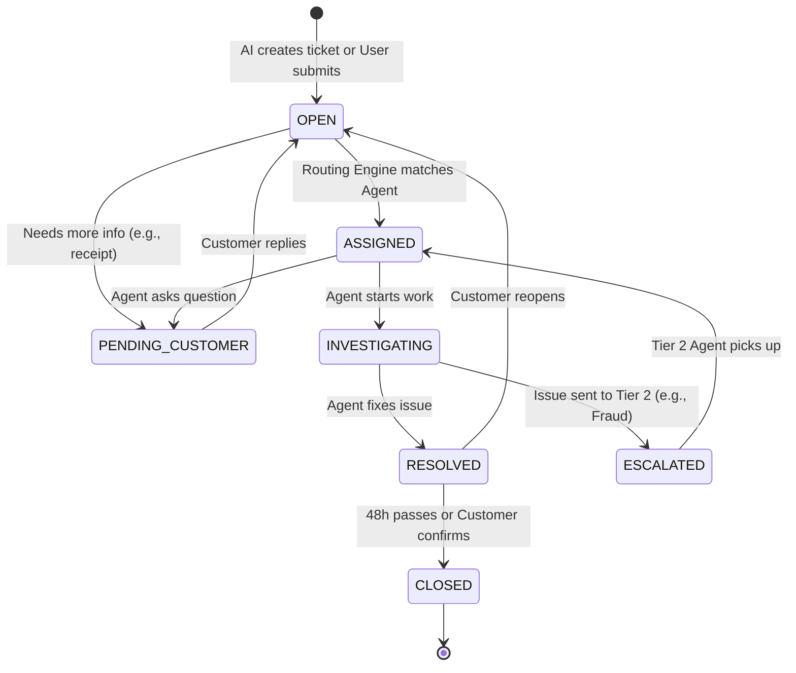
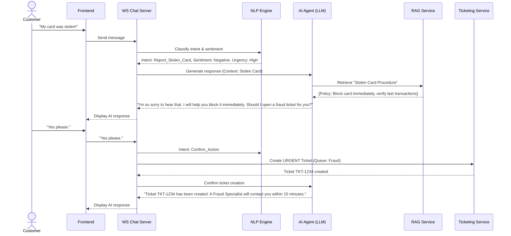

# Ticketing Logic & AI Chatbot Design

This document details the core intelligence of the Banking AI Copilot: the smart ticketing system that handles escalations, and the AI Chatbot powered by Retrieval-Augmented Generation (RAG).

## E. Ticketing System Logic

The ticketing system must handle complex, high-stakes banking scenarios, such as immediate fraud alerts, loan inquiries, and standard customer support queries.

### 1. SLA Rules & Priorities

We define specific Service Level Agreements (SLAs) based on the intent identified by the AI Chatbot or the manual selection by a user.

| Intent / Category | Priority | SLA Response Time | Assigned Queue | Automated Action on Breach |
| :--- | :--- | :--- | :--- | :--- |
| **Fraud Report** | `URGENT` | 15 Minutes | `Fraud Specialist` | PagerDuty alert, SMS to Supervisor |
| **Lost/Stolen Card** | `HIGH` | 30 Minutes | `Card Services` | Escalate to Fraud queue |
| **Dispute Charge** | `MEDIUM` | 4 Hours | `Disputes Team` | Reassign to next available agent |
| **Loan Inquiry** | `MEDIUM` | 8 Hours | `Loan Officers` | Manager dashboard highlight |
| **General Inquiry** | `LOW` | 24 Hours | `Tier 1 Support` | Auto-reply acknowledging delay |

### 2. State Transitions (Ticket Lifecycle)

A ticket follows a strict state machine to ensure no request is dropped.

### 3. Automated Routing Logic

1.  **Intent Classification:** The AI NLP service determines the intent (e.g., "User wants to dispute a $50 charge from Amazon").
2.  **Entity Extraction:** The AI extracts the Account Number or Card Last 4 Digits.
3.  **Ticket Creation:** The system creates a ticket with status `OPEN`, tags `[Dispute, Amazon]`, and sets priority `MEDIUM`.
4.  **Queue Assignment:** The routing engine checks available agents with the role `Disputes Team` and assigns the ticket to the agent with the lowest active load.
5.  **Copilot Initialization:** The system automatically generates a summary of the AI chat and retrieves the "Dispute Resolution Policy" via RAG, displaying it in the Agent Dashboard before they even open the ticket.

---

## F. AI Chatbot Design (GenAI + RAG)

The AI Chatbot acts as the first line of defense (Tier 0). It uses a sophisticated RAG pipeline to answer policy questions and an NLP pipeline to handle transactional intents.

### 1. RAG Integration Pipeline

The RAG (Retrieval-Augmented Generation) pipeline ensures the LLM answers based *only* on the bank's approved internal documents, reducing hallucinations.

**Ingestion Flow (Admin side):**
1.  Admin uploads a PDF (e.g., "2024 Credit Card Fee Schedule").
2.  The document is parsed and chunked into overlapping text segments (~500 tokens each).
3.  Each chunk is sent to OpenAI's embedding model (`text-embedding-3-small`) to create a vector.
4.  The vector and original text chunk are stored in PostgreSQL using the `pgvector` extension.

**Retrieval Flow (Customer side):**
1.  Customer asks: *"What is the late fee on my Platinum card?"*
2.  The question is embedded into a vector.
3.  A cosine similarity search (`pgvector`) finds the top 3 most relevant document chunks (e.g., the section detailing late fees).
4.  The retrieved chunks are injected into the LLM system prompt:
    `"Answer the user using ONLY the following context: [Retrieved chunks...]"`
5.  The LLM generates a precise, policy-backed answer.

### 2. NLP Pipeline & Conversation Flow

The AI doesn't just answer questions; it drives workflows based on intent.

### 3. Context Memory

The chatbot maintains context over the session.
*   **Short-term memory:** The last 10 messages are passed to the LLM to maintain conversational flow.
*   **Long-term memory:** Summaries of past resolved tickets and user metadata (e.g., "VIP Customer", "Holds Platinum Card") are injected into the system prompt at the start of the session to personalize the interaction.